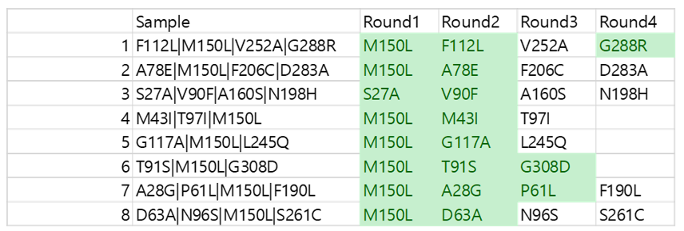

## MPH Single Directly Mutation Round 1

### Objective

-   Constructing MPH mutants with multiple mutations with biofoundry facility

### PCR for introducing a mutation

#### 2024.04.03

#### Materials

-   0.2ml 8-Strip and Individual PCR Tubes
-   KOD OneTM PCR Master Mix(KMM-101)
-   Distilled water
-   Primer(10pmol/ul)->Non-Overlapping primers

#### Sample info

-   round 1 mutant list

    -   M150L
    -   S27A

-   사용한 primer list <https://github.com/sblabkribb/proteinengineering_DmpR/blob/main/paper_draft/Supplementary_Data/Primer_list.xlsx>

-   M150L_F GGTGGTCTGTTGGTTGGTGAACAG
-   n_M150L_R   AACGTGGTCCGGGTGCAT
-   S27A_F	ACCCACGCGGCTGCGGCGGCGCCG	
-   n_S27A_R    AACGAAAACCATCTGCGC

#### Equipment

-   C1000 Series Touch Thermal Cyclers

#### Method

-   MPH_DmpR_Wild type를 template로 사용
-   Sample수 만큼 PCR tube에 KOD mixer와 DW, Template을 나눠 분주합니다.

<mutant PCR component>

| component            | volume |
|----------------------|--------|
| 10pmol/ul F,R primer | 0.5ul  |
| KOD mix              | 12.5ul |
| Template             | 1ul    |
| DW                   | 10.5ul |
| Total                | 25ul   |

-   Centrifuge를 이용해 약 5초동안 spin down 시킨다.

-   C1000 Series Touch Thermal Cyclers 에 아래와 같이 설정하고 plate를 넣어준다.

| Steps | temperature | time                        | description          |
|-------|-------------|-----------------------------|----------------------|
| 1     | 98℃         | 5min                        | initial denaturation |
| 2     | 98℃         | 10sec                       | denaturation         |
| 3     | 55℃         | 10sec                       | annealing            |
| 4     | 68℃         | 1min 30sec Go to 2step(x29) | extension            |
| 5     | 68℃         | 5min                        | final extension      |
| 6     | 4℃          | \~                          |                      |

-   PCR reaction이 끝난 뒤, 5ul는 따로 빼서 tube에 보관한다. (gel electrophoresis용)
### AMPure 활용한 PCR purification

#### Materials

-   Agencourt AMPure XP beads (Beckman Coulter™, A63881)
-   70\~80% Ethanol

#### Equipment

-   96 Well Magnetic rack PCR plate 0.2ml
-   0.2ml 8-Strip and Individual PCR Tubes
-   Vertexer
-   Mini Centrifuge(0.2ml PCR tube)

#### Samples

-   앞 단계에서 만들어진 Single Mutation PCR product 20ul per PCR tube

#### Methods

-   앞 단계의 PCR이 끝난 PCR tube에 20ul magnetic bead 넣는다.

-   Tube를 짧게 vortexing후, 약 3초동안 centrifuge시킨다.(많이 centrifuge시키면 bead들이 전부 가라앉아 층을 형성하며 효율 낮아짐)

-   5분동안 room temperature에서 incubation시킨다.

-   magnetic rack을 tube 아래에 위치함으로 bead가 well의 벽에 붙는 것을 확인한다.

-   supernatant를 tip을 이용해 제거한다. (bead가 딸려오지 않도록 주의)

-   100ul ethonl을 tube에 넣고, 바로 ethanol을 제거한다. (2번 반복) 그리고 약 2분동안 tube의 뚜껑을 열고 환기 시켜준다.

    -   ethnol 농도는 70-80%이다.
    -   ethnol을 제거할때, tip을 tube의 바닥에 닿도록 위치시키고, 뽑아준다.
    -   이 과정동안 tube는 magnetic에 계속 고정시킨 상태이다.
    -   마지막 Washing 단계에서 낮은 volume의 pipette을 이용하여 최대한 supernatant를 제거한다.

-   위 tube에 20ul DW를 넣고 votexing후 3초간 centrifuge, 10분동안 incubation(상온, 10분)

-   tube를 magnet으로 옮기고 상등액(DNA)을 뽑아준다

### Gel electrophoresis

-   DNA 확인시 전기영동 수행, 이번에는 수행하지 않음

### Ligation

#### Materials

-   T4 DNA Ligase(# M0202M)
-   T4 Polynucleotide Kinase(# M0201L)
-   T4 DNA Ligase Reaction Buffer(# B0202S)
-   DpnI(# R0176L)

#### Equipment

-   C1000 Series Touch Thermal Cyclers
-   0.2ml 8-Strip and Individual PCR Tubes

#### Samples

-   앞서 정제된 DNA (Single Mutation PCR product 20ul per PCR tube)

#### Methods

-   다음과 같은 volume의 component를 앞서 20 $\mu$L DNA가 포함된 PCR tube에 넣는다.

|     | Component |       |
|-----|-----------|-------|
| 1   | T4 ligase | 1ul   |
| 2   | T4 PNK    | 1ul   |
| 3   | buffer    | 2.5ul |
| 4   | DpnI      | 1ul   |

-   thermocycler를 통해 아래와 같은 condition으로 돌려준다.

|     | temperature | time      |
|-----|-------------|-----------|
| 1   | 37℃         | 30min     |
| 2   | 24℃         | 1hr 30min |
| 3   | 65℃         | 10min     |
| 4   | 4℃          | \~        |

### Transformation

#### Materials

-   DH5a competent cell
-   1.5ml eptube
-   ice bath
-   ice
-   Antibiotic LB agarose plate(Cm\^R)
-   S.O.C. Medium

#### Equipment

-   water bath(42℃)
-   shaking incubator(37℃,200rpm)
-   incubator(37℃,200rpm)
-   spreader

#### Samples

-   앞서 만들어진 Ligation된 products

#### Methods

-   DH5 $\alpha$ competent cell 50ul를 새로운 ep tube와 PCR tube로 각각 옮긴다.
-   Single mutation product(after ligation)를 ep tube에는 5$\mu$l, PCR tube에는 100$\mu$를 10ul를 각 tube에 넣는다.
-   ice에서 30min간 incubation
-   water bath을 이용한 heatshock(42℃, 1.5min)
-   ice bath을 이용한 incubation(4℃,2min)
-   S.O.C. Medium를 ep tube에는 200$\mu$l, PCR tube에는 100$\mu$를 넣어준다.
-   Sample이 들어있는 PCR tube를 스펀지에 끼워 잘 고정시킨 뒤, shaking incubator(37℃,200rpm)에서 45분간 보관
-   Antibiotic LB agarose plate(Cm^R)(Cm^R)에 tube에 있던 배양액을 전부 뿌려주고 spreader로 깔아준다.
    -   cell이 터지지 않도록 spreading시 힘을 많이 주지 않도록 한다.
-   overnight으로 37℃ incubation에서 배양시킨다.

#### Results

    -   sample 1(M150L) 
    -   sample 2(S27A)

-   colony가 S27A에서는 거의 보이지 않는다.
-   M150L에서 PCR tube에서 transformation 결과를 보았을때, 효율이 너무 좋지 않다. 앞으로 계속 사용할 수 있을지 Discussion 필요
-   colony 크기가 많이 작음

### Colony picking and cell cuture

#### 2024.04.04

#### Materials

-   LB medium
-   Chloramphenicol(34μg/mL)

#### Equipment

-   96-Well Cell Culture Plate, Black, with Clear Flat-Bottom
-   shaking incubator(37℃, 550rpm) based Plate
-   이쑤시개
-   CleanBench

#### Samples

-   Colony Antibiotic plate(Cm\^R)

-   앞서 spreading 되어 Cell이 배양된 4개 plates
    -   \<Sample 1 : M150L_PCR tube>
    -   \<Sample 2 : M150L_ep tube>
    -   \<Sample 3 : S27A_PCR tube>
    -   \<Sample 4 : S27A_ep tube>

#### Methods

-   각 plate당 4개의 colony를 picking하여 culture 예정

-   200ul LB + 0.2ul chloramphenicol(Cm) per well 기준으로 96-well microtiter plate에 분주

-   4개 plate에서 4개씩 picking하여 각 well에 접종

-   37℃ 550rpm 2.5시간동안 shaking incubation

### Barcode PCR

#### Materials

-   KOD OneTM PCR Master Mix(KMM-101)
-   Distilled water
-   Hardshell PCR plates, 96-well, PerkinElmer(No. 6008870)
-   PCR Plate, 384-well, Thermofisher (Cat. No. AB1384)
-   PCR plate seals\_'B' Clear Adhesive Seal(모델 번호 : MSB1001)
-   Primer (10pmol/$\mu$l) with barcodes and samples
    -   construction barcode primer method <https://mutprimergen.streamlit.app/>

#### Equipment

-   Echo 525 Liquid handler (Product No: 001-10080)
-   Biometr TRobot II 96G, 230V(Order number: 846-070-902)

#### Samples

-   Sample in culture plate 96 well plate_clear base

#### Methods

-   echo525 작동을 위한 csv file 작성 (ink csv file or a script file)

-   384 plate(echo 전용 plate)의 well에 10pmol/ul의 primer를 25ul 넣어줍니다 (Janus 등 liquid handler 사용 가능)

    -   40 μL maximum well volume, 25 μL working volume
    -   384 plate에 한번 primer를 다량 넣어주면, 계속 source plate로 저장(4℃)하고 여러번 사용가능하다.

-   Sample수 만큼 PCR plate에 KOD mixer와 DW을 나눠 분주합니다.

-   primer를 Echo525를 통해 분주합니다. (각 well당 primer_F,R 분주)

    -   source well plate는 384 well plate를 사용하고, destination plate는 96well PCR Plate로 사용합니다.

-   Echo 작동법 <https://github.com/sblabkribb/mvaopt/blob/main/labnote/007_jh_labnote/Echo525%20protocol.pptx>

\< Barcode PCR component\>

| component            | volume |
|----------------------|--------|
| 10pmol/ul F,R primer | 100nl  |
| KOD mix              | 5ul    |
| Template             | 2ul    |
| DW                   | 3ul    |
| Total                | 25ul   |

-   Echo525 분주가 끝나고 plate를 꺼낸 뒤, culture plate 96 well plate에서 sample을 2ul씩 PCR plate에 담습니다.

    -   각 well 안의 샘플은 동일한 well 위치로

-   Centrifuge를 이용해 약 5초동안 spin down 시킵니다.

-   PCR plate seals('B' Clear Adhesive Seal)를 PCR plate 뚜껑에 붙인 뒤, roller로 문질러 떨어지지 않도록 합니다.

-   Biometr TRobot II 96G, 230V에 아래와 같이 설정하고 plate를 넣어줍니다.

| Steps | temperature | time                          | description          |
|-------|-------------|-------------------------------|----------------------|
| 1     | 98℃         | 5min                          | initial denaturation |
| 2     | 98℃         | 10sec                         | denaturation         |
| 3     | 55℃         | 10sec                         | annealing            |
| 4     | 68℃         | 30sec 'Go to 2step(x29)' | extension            |
| 5     | 68℃         | 5min                          | final extension      |
| 6     | 4℃          | \~                            |                      |

### Sequencing library construction

#### 2024.04.05

#### Materials

-   plasmid DNA(purification)
-   Native Ligation Sequencing Kit(SQK-LSK114)
-   Freshly prepared 80% ethanol in nuclease-free water
-   Qubit™ Assay Tubes (Invitrogen, Q32856)

#### Equipment

-   0.2ml 8-Strip and Individual PCR Tubes
-   1.5 ml Eppendorf DNA LoBind tubes
-   GridION device
-   Ice bucket with ice
-   Hula mixer
-   Qubit fluorometer

#### Samples

-   위 PCR 완료된 96 plate

#### Method

-   Ligation Sequencing manual 참고 <https://github.com/sblabkribb/proteinengineering_DmpR/blob/main/labnote/019_bfmphmutant/protocol/Nanopore%20Sequencing%20kit%20protocol.md>

-   `Repair end prep` 수행 후 Qubit을 이용해 농도를 checking한다

    -   Qubit 사용방법

        1.  standed #1,#2를 만들어 줘야 하는데, working solution 190ul를 2개의 tube에 넣어준다.
        2.  1개의 tube에 199ul working solution을 넣어준다.
        3.  190ul 넣어준 tube에는 각각 standard 10ul씩 넣어준다.
        4.  199ul 넣어준 tube에는 1ul sample을 넣어준다.
        5.  standard 부터 측정하여 calibration을 마치고 sample의 농도를 확인한다.

### Insert sequencing

#### 2024.04.05

#### Materials

-   Native Ligation Sequencing Kit(SQK-LSK114)
-   Flow Cell Flush (FCF)
-   Flow Cell Tether (FCT)
-   Library Solution (LIS)
-   Library Beads (LIB)
-   Sequencing Buffer (SB)

#### Equipment

-   0.2ml 8-Strip and Individual PCR Tubes
-   1.5 ml Eppendorf DNA LoBind tubes
-   GridION device

#### Samples

-   Pooling 된 12uL DNA sample in PCR tube

#### Method

-   Priming and loading the SpotON flow cell 참고 <https://github.com/sblabkribb/proteinengineering_DmpR/blob/main/labnote/019_bfmphmutant/protocol/Nanopore%20Sequencing%20kit%20protocol.md>

-   device operation

    -   Run step
        1)  Position: 이름 설정
        2)  Kit: `Ligation Sequencing Kit(SQK_LSK114)` 선택
        3)  Run options: Run until_Run limit_value\_`4`Hrs, Minimum read length: `200bp`, Adaptive sampling: `off`
        4)  Analysis: Basecalling options_model\_`Super-accurate basecalling`
        5)  Output: Basecalling reads_설정\_`unzip`file

#### Result

-   Raw file 위치 
<>

### Insert sequence analysis

#### 2024.04.08

#### Materials

-   'sort_barcode_consensus_96_seqs_dna' file

#### Equipment

-   Computer(snapgene, puTTy-\>163 Server)

#### Samples

-   'sort_barcode_consensus_96_seqs_dna' file

#### Method

-   snapgene으로 reference file에 들어가 sequence result file을 align 시킴

-   Nanopore sequencing result analysis 참고 https://github.com/sblabkribb/proteinengineering_DmpR/blob/main/labnote/019_bfmphmutant/protocol/How%20to%20Run%20Nanopore%20analysis.md

-   결과 자료 

-   이 결과를 기반으로 전체 plasmid 서열을 분석하기 위한 DNA prep 및 sequencing 수행

    -   결과 : M150L은 mutant가 잘 만들어졌음, S27A는 증폭되지 않음

### Cell culture for plasmid prep

#### Materials

-   LB medium
-   Chloramphenicol(34μg/mL)
-   Distilled water

#### Equipment

-   14ml conical tube
-   swing-bucket rotors
-   Eppendorf MiniSpin micro centrifuge with rotor
-   Incubator Shaker(96-well plate)
-   nanopore

#### Samples

-   Cells in EPtube

#### Method

-   14ml conical tube에 2ml LB Broth와 2ul chloramphenicol을 넣는다. (12개 sample을 만들어야 하기에 12개 conical tube을 사용함)

-   키워두었던 EPtube에서 2ul씩 tube에 옮겨준다.

-   37℃ 200rpm overnight로 키운다.

### Miniprep

#### 2024.04.17

#### Materials

-   cell culture

#### Equipment

-   Wizard plus SV Minipreps DNA Purification System kit(REF: A1460)
-   1.5ml eptube
-   Eppendorf MiniSpin micro centrifuge with rotor

#### Sample

-   위 14ml tube에 배양된 12개 cell

#### Methods

Wizard plus SV Minipreps DNA Purification System(REF: A1460)

-centrifugation protocol

-   production of cleared lysate

1.  5분동안 overnight culture(2ml)을 centrifuge하여 pellet을 만든다.(13,000rpm)
2.  250ul의 cell resuspension solution으로 pellet을 pipetting하고 eptube로 옮긴다.
3.  각 샘플에 250ul의 cell lysis solution를 추가시킨다.(4회 뒤집으며 섞는다.)
4.  10ul의 alkaline protease solution을 추가시킨다 .(4회 뒤집으며 섞는다.) 그리고 5분동안 room temperature에서 incubate한다.
5.  netralization solution의 350ul를 추가시킨다. (4회 뒤집으며 섞는다.)
6.  room temp.에서 10분동안 최대 speed로 centrifuge한다.

-   binding of plasmid DNA

1.  Collection tube안에 spin colume을 결합하여 sample수 만큼 준비한다.(12개 sample)
2.  cleared lysate를 spin column에 pipette를 이용하여 옮겨준다.
3.  top speed로 1분동안 room temp.에서 centrifuge시킨다. 그리고 Collection tube의 물을 제거 한다.

-   washing

1.  750ul wash solution(ethanol added)를 넣는다. 1분동안 top speed로 centrifuge 시킨다. Collection tube의 물을 제거 한다.
2.  250ul의 wash solution을 넣고 윗 과정을 반복
3.  room temp. top speed로 centrifuge를 2분 돌린다.

-   elution

1.  spin column을 e-tube로 옮긴다.
2.  50ul nuclease-free water을 spin column에 pipette으로 옮겨준다. room temp.에서 최대 speed로 1분동안 centrifuge 시켜준다.

#### measure concentration

1)  각 Sample을 2ul씩 따서 nanodrop으로 농도를 측정한다.

-> 농도 기입 했어야 함.

### Library preparation for Plasmid sequencing

#### Materials

-   plasmid DNA(purification)
-   Rapid Barcoding Kit 24 V14 (SQK-RBK114.24) OR Rapid Barcoding Kit 96 V14 (SQK-RBK114.96)
-   Freshly prepared 80% ethanol in nuclease-free water
-   Qubit™ Assay Tubes (Invitrogen, Q32856)

#### Equipment

-   0.2ml 8-Strip and Individual PCR Tubes
-   1.5 ml Eppendorf DNA LoBind tubes
-   GridION device
-   Ice bucket with ice
-   Hula mixer
-   Qubit fluorometer

#### Sample

-   40\~60ug/ul purification DNA sample

#### Method

-   Rapid sequencing plasmid manual 참고

    -   

        11. Rapid sequencing plasmid kit <https://github.com/sblabkribb/proteinengineering_DmpR/blob/main/labnote/019_bfmphmutant/protocol/Nanopore%20Sequencing%20kit%20protocol.md>

-   device operation

    -   Run step
        1)  Position: 이름 설정
        2)  Kit: `Rapid Barcoding Kit 96 V14 (SQK-RBK114.96)` 선택
        3)  Run options: Run until_Run limit_value\_`4`Hrs, Minimum read length: `200bp`, Adaptive sampling: `off`
        4)  Analysis: Basecalling options_model\_`Super-accurate basecalling`
        5)  Output: Basecalling reads_설정\_`unzip`file

-   origene에 mutation이 있으면 copy number에 이상이 있을 수 있기 때문에 전체 plasmid를 확인해야 한다.

### Sequence analysis

#### Materials

-   raw data 

#### Equipment

-   Computer(snapgene, puTTy-\>163 Server)

#### Samples

-   raw data 

#### Method

-   snapgene으로 reference file에 들어가 barcode file을 align 시킴

-   Nanopore sequencing result analysis 참고 https://github.com/sblabkribb/proteinengineering_DmpR/blob/main/labnote/019_bfmphmutant/protocol/How%20to%20Run%20Nanopore%20analysis.md
### Result

-   제작 완료 sample
    -   M150L

