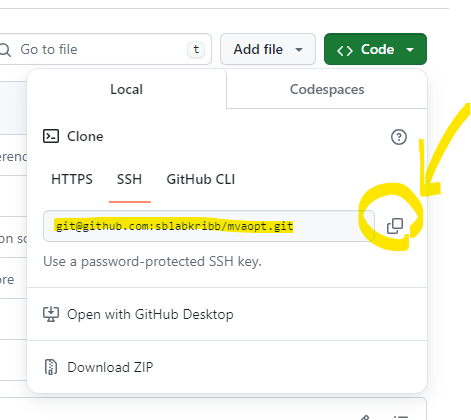

## labnote 만들기

[기본적인 Markdown 노트작성 메뉴얼](https://quarto.org/docs/authoring/markdown-basics.html)

### Step 1. Visual Studio Code(VSCode) 다운로드

[Visual Studio Code의 공식 웹사이트](https://code.visualstudio.com/)

-   위 링크로 들어가서 현재 운영 체제에 해당하는 '다운로드'버튼을 클릭합니다.
-   다운로드가 완료되면 설치 파일을 실행합니다.
-    설치 마법사가 시작되면, 기본적으로 제안되는 옵션을 사용하여 설치를 진행합니다. 필요한 경우 사용자 지정 설치 옵션을 선택할 수 있습니다.

### Step 2. 프로젝트 생성 확인 및 Markdown 파일 생성


1) VSCode의 왼쪽 위 `File`로 들어가 `New File`로 들어갑니다. 

2) '파일이름'을 입력한 뒤, '파일이름.md'형태로 저장합니다.
-   이름은 '001_Genetic_Circuit_DmpR'처럼 '순번_실험내용'으로 합니다.

3) 본인 PC의 해당 파일 경로로 들어가면, 파일이 저장된 것을 확인할 수 있을 것입니다. 

### Step 3. Extensions을 통한 Quarto 설치


4) 왼쪽 사이드바에서 확장 아이콘을 클릭합니다.

5) Extensions 패널에서 검색 창에 "Quarto"를 입력합니다.

6) 검색 결과에서 Quarto를 찾으면 설치 버튼이 나타납니다. 해당 버튼을 클릭하여 Quarto를 설치합니다.

## Git의 버전 관리 과정 및 협업

### Git 저장소의 구조 및 기본 작업 흐름


```         
-   위 그림은 기본적으로 github가 어떻게 저장 및 공유를 하는지를 표현한 것입니다. 'Working Directory'는 우리가 작업하는 공간(예를 들어 .md file)을 말합니다. 그리고 'Staging Area'는 Git으로 올라가기전 파일들의 저장공간입니다. 우리는 'git add .' 명령어를 통해 파일들을 commit할 준비합니다.
-   'staging area'에서 'local repository'로 'commit'함으로 변경내용이 기록됩니다. 이는 '버전관리 및 파일 추적'을 가능케 합니다. 모든 변경내용들은 'history'에서 확인할 수 있습니다.
-   원격저장소(remote repository)는 github에 저장되어 있는 온라인 저장소 개념이며, 반대로 로컬저장소(local repository)는 본인 컴퓨터의 저장소를 말합니다.
-   원격저장소(remote repository)는 팀원 모두가 공유하고 있습니다. 팀원 누군가 함부로 저장소의 내용을 변경할 수도 있기에 이를 방지할 수 있어야 합니다. 그래서 로컬저장소(local repository)가 도입되었습니다.
-   저장소(repository)는 'branch'로 구성되어 있습니다. main branch는 remote repository에 저장되어 있고, 팀원들은 'main repository'의 내용(파일)을 자신의 컴퓨터 local repository로 'git clone'으로 불러옵니다. 개인이 local repository에서 수정 작업을 하면 '개인의 branch' 형태로 저장이 됩니다. 이 과정이 'git add'와 'git commit'입니다.
-   local repository에서 remote repository로 변경내용을 upload하는 작업이 필요할 것입니다. 'git push'를 이용하여 '개인의 branch'를 remote repository로 옮긴다. 그럼 github에서 remote repository에 원래 있었던 main branch와 push된 '개인의 branch'를 확인할 수 있습니다.
-   두 branch를 합치는 과정이 merge입니다. merge를 하면, local에서 생성했던 branch는 사라지고 main branch만 변경된 내용을 포함해서 남게됩니다.
```
### Step 1. 새로운 Terminal 생성


1) 왼쪽 위 `Terminal`로 들어가 `New Terminal`로 들어갑니다.

2) 아래쪽에 `Terminal`창이 생긴 것을 확인 할 수 있습니다.

3) 아래 명령어를 `terminal` 창에 입력함으로 파일 저장경로를 지정합니다. 
- `Tab` 키를 누르면, 입력한 문자열과 일치하는 디렉토리 또는 파일 이름이 있는 경우 해당 문자열이 자동으로 완성됩니다.

```{bash}
cd .\'저장하려는 파일 경로'
```

### Step 2. 새로운 Branch 생성

4)  먼저 새로운 'branch'를 만들어야 한다. 아래 명령어를 `terminal` 창에 입력합니다.
    ```{bash}
    git checkout -b 'branch이름'
    ```

### Step 3. 원격 저장소와 연결

5)  다음으로 원격 저장소(remote repository)를 연결해줄 것입니다. 아래 명령어를 'terminal'로 입력합니다.

    -   'origin'이라는 이름으로 '원격저장소 URL'의 별칭으로 사용될 것입니다.

```{bash}
git remote add origin '본인이 복사했던 SSH 혹은 HTTPS'
```

-   'github'에 로그인하면 ‘sblkribb’이 보일 것입니다. 자신의 연구주제에 맞는 ‘Repositories’에 찾아 들어갑니다. 아래 그림과 같이 'code'를 찾아 눌러주고, SSH 주소(혹은 HTTPS)를, Copy합니다. 그리고 위 명령어와 같이 입력하여 줍니다.



### Step 4. 원격 저장소 확인

6)  원격저장소와 연결이 성공적으로 이루어졌는지 확인합니다. 아래 명령어는 현재 로컬 저장소에 등록된 모든 원격 저장소의 목록을 보여주도록 합니다. 'terminal'에 입력합니다.

```{bash}
git remote -v
```


-   위 그림에서 보는 것과 `origin`이 현재 원격 저장소 이름인 것을 알 수 있습니다.

### Step 5. 변경 내용 Staging Area로 이동

7)  'git add' 명령어를 통해 Working directory에서 Staging area로 변경사항을 추가합니다. 아래 명령어를 'terminal'에 입력합니다.

```{bash}
git add .
```

-   위 명령어를 통해 모든 파일을 Staging Area로 옮겼습니다. 하지만 하위 디렉토리에 있는 파일들까지 add 되므로 원하지 않는 파일이 올라갈 수 있습니다.

-   다른방법은 다음과 같다. 아래 명령어를 통해 특정 파일만 지정하여 add 시킬 수 있습니다.

```{bash}
git add '파일명.md'
```

### Step 6. 변경 내용 Local Repository로 Commit

8)  'git commit' 명령어를 통해 Staging Area에서 local repository로 변경사항을 옮깁니다. 이때 메시지가 필요한데, 변경된 내용에 관한 메시지(혹은 날짜)를 입력하시면 됩니다. 이 메시지도 같이 commit 되어 변경사항을 구분할때 사용됩니다. 아래 명령어를 'terminal'에 입력합니다.

```{bash}
git commit -m "message"
```


-   명령어를 이용하는 방법도 있지만, 왼쪽 패널의 `Source control` 패널에 들어가서 `Message`를 입력하고 `Commit` 버튼을 클릭해서 손쉽게 commit하는 방법도 있다.

### Step 7. 변경 내용 Remote Repository로 Push

9)  이제 local repository의 변경내용을 remote repository로 옮길 것입니다. 아래 명령어를 'terminal'에 입력합니다.

```{bash}
git push origin 'branch이름'
```

-   local branch에서 변경사항을 remote repository에 push합니다. 즉, 'branch이름'이라는 branch 가 remote repository인 'origin'으로 push 됩니다.


-   위 그림과 같이 왼쪽 패널의 `Source control` 패널에 들어가서 `Sync Changes`를 클릭하면 push가 자동으로 됩니다.
-   위 그림에서 `Sync Changes` 아래 보이는  `Main`는 본인이 설정한 'branch이름'이 될 것 입니다. 


10) github로 접속하여 확인하면, 새로운 branch가 생긴 것을 확인할 수 있으며, 업로드 메시지가 뜹니다.

### Step 8. Compare & pull request

7.  Remote repository의 main branch와 local repository의 나의 branch를 합쳐야 합니다. 아래 그림같이 'Compare & pull request' 를 클릭합니다.

    

### Step 9. Pull Request 생성 및 Merge

8.  이제 'title', 'description'을 작성하면 'pull request'가 완료됩니다. 'pull request'를 통해 다른 팀원들과 '리뷰 및 검토'를 진행할 수 있습니다. 다른 팀원들은 'Add a comment'를 통해 피드백을 주고 받을 수 있습니다.


9.  위 그림에서 'Merge pull request'를 확인할 수 있을 것입니다. 이를 통해 branch간의 통합이 이루어 질 수 있습니다.


